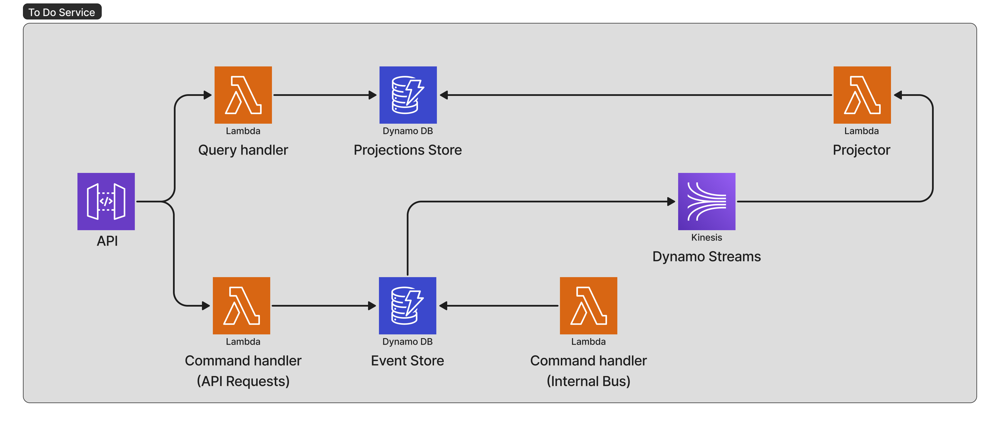

# Not included

- Implement required capabilities
- Implement Projections following the required access patterns
- Implement Serverless adapter
- Implement Standalone app for commands coming from the event bus
- Update documentation
- - Include full instructions for dynamodb or anything else needed

# Nest proof of concept: command query responsibility segregation + event sourcing

## Architecture


## Requirements
Not all requirements might be implemented.

### Access Patterns


**ToDoList**

- List all todo lists
- Get todo list by id
- Get last 5 todo lists
- List todo lists that have incomplete items


**ToDo**

- List all todo items
- Get todo item by id
- Get all todo items that belong to a list


### Capabilities


**ToDoList**

- Create a new list passing a title
- Creating a new todo item as part of the list
- Transfering a todo item from one list to the other


**ToDo**

- Rename
- Mark as complete
- Mark as incomplete


## Running DynamoDB local
You need Docker to be installed for this. Run `docker-compose up` that will pull the image and have DynamoDB Local running in localhost:8000.
You can verify the installation running `aws dynamodb list-tables --endpoint-url http://localhost:8000 --region localhost` and you should see something like this:

```
{
    "TableNames": [
    ]
}
```

Now to create the event store table for this project run:
```
aws dynamodb create-table --attribute-definitions AttributeName=Pk,AttributeType=S AttributeName=Sk,AttributeType=S --table-name EventStoreLocal --key-schema AttributeName=Pk,KeyType=HASH AttributeName=Sk,KeyType=RANGE --provisioned-throughput ReadCapacityUnits=10,WriteCapacityUnits=10 --output json --endpoint-url http://localhost:8000 --region localhost
```

This will create a table named `EventStoreLocal` with a composed partition key of HASH `Pk` of type `String` and RANGE key `Sk` of type `String`.

### DynamoDB CLI cheatsheet

#### list-tables
```
aws dynamodb list-tables --endpoint-url http://localhost:8000 --region local
```

#### scan-table
```
aws dynamodb scan --table-name EventStoreLocal --region local --endpoint-url http://localhost:8000 --output json
```

#### delete-table
```
aws dynamodb delete-table --table-name EventStoreLocal --endpoint-url http://localhost:8000 --region local --output json
```

#### create-table
```
aws dynamodb create-table --attribute-definitions AttributeName=Pk,AttributeType=S AttributeName=Sk,AttributeType=S --table-name EventStoreLocal --key-schema AttributeName=Pk,KeyType=HASH AttributeName=Sk,KeyType=RANGE --provisioned-throughput ReadCapacityUnits=10,WriteCapacityUnits=10 --output json --endpoint-url http://localhost:8000 --region localhost
```

## Resources
- [Official Nest CQRS overview](https://docs.nestjs.com/recipes/cqrs)
- [mguay nestjs cqrs + ddd example](https://github.com/mguay22/nestjs-ddd)
- [Running DynamoDB Local](https://www.youtube.com/watch?v=z77UbwWf1po)

# NestJS generic read me

<p align="center">
  <a href="http://nestjs.com/" target="blank"></a>
</p>

[circleci-image]: https://img.shields.io/circleci/build/github/nestjs/nest/master?token=abc123def456
[circleci-url]: https://circleci.com/gh/nestjs/nest

  <p align="center">A progressive <a href="http://nodejs.org" target="_blank">Node.js</a> framework for building efficient and scalable server-side applications.</p>
    <p align="center">
<a href="https://www.npmjs.com/~nestjscore" target="_blank"></a>
<a href="https://www.npmjs.com/~nestjscore" target="_blank"></a>
<a href="https://www.npmjs.com/~nestjscore" target="_blank"></a>
<a href="https://circleci.com/gh/nestjs/nest" target="_blank"></a>
<a href="https://coveralls.io/github/nestjs/nest?branch=master" target="_blank"></a>
<a href="https://discord.gg/G7Qnnhy" target="_blank"></a>
<a href="https://opencollective.com/nest#backer" target="_blank"></a>
<a href="https://opencollective.com/nest#sponsor" target="_blank"></a>
  <a href="https://paypal.me/kamilmysliwiec" target="_blank"></a>
    <a href="https://opencollective.com/nest#sponsor"  target="_blank"></a>
  <a href="https://twitter.com/nestframework" target="_blank"></a>
</p>
  <!--[](https://opencollective.com/nest#backer)
  [](https://opencollective.com/nest#sponsor)-->

## Description

[Nest](https://github.com/nestjs/nest) framework TypeScript starter repository.

## Installation

```bash
$ npm install
```

## Running the app

```bash
# development
$ npm run start

# watch mode
$ npm run start:dev

# production mode
$ npm run start:prod
```

## Test

```bash
# unit tests
$ npm run test

# e2e tests
$ npm run test:e2e

# test coverage
$ npm run test:cov
```

## Support

Nest is an MIT-licensed open source project. It can grow thanks to the sponsors and support by the amazing backers. If you'd like to join them, please [read more here](https://docs.nestjs.com/support).

## Stay in touch

- Author - [Kamil Myśliwiec](https://kamilmysliwiec.com)
- Website - [https://nestjs.com](https://nestjs.com/)
- Twitter - [@nestframework](https://twitter.com/nestframework)

## License

Nest is [MIT licensed](LICENSE).
